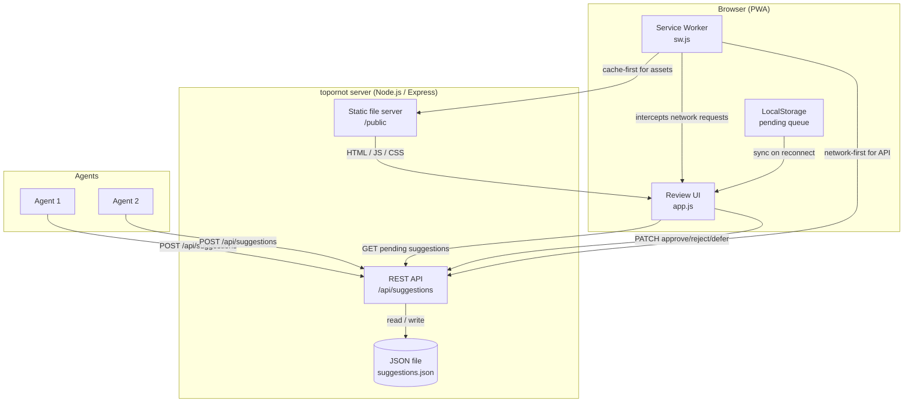

# topornot

Approval queue for agent-generated suggestions. Agents submit suggestions via a REST API; human reviewers approve, reject, or defer them through a card-based web UI (or directly through the API).

---

## Table of Contents

- [Features](#features)
- [Architecture](#architecture)
- [Prerequisites](#prerequisites)
- [Installation](#installation)
- [Running the application](#running-the-application)
- [Configuration](#configuration)
- [API reference](#api-reference)
- [Authentication model](#authentication-model)
- [Running tests](#running-tests)

---

## Features

- Simple card-based review UI – one suggestion at a time
- Keyboard shortcuts (`a` approve, `z` reject, `d` defer; arrow keys also work)
- Touch gestures – swipe right to approve, left to reject, up to defer
- Offline-first PWA – works without a network connection and syncs when reconnected
- Lightweight JSON file database – zero external dependencies to run locally
- REST API for programmatic integration with agents and CI pipelines

---

## Architecture



---

## Prerequisites

- [Node.js](https://nodejs.org/) v18 or later
- npm (bundled with Node.js)

---

## Installation

```bash
# 1. Clone the repository
git clone https://github.com/bmordue/topornot.git
cd topornot

# 2. Install dependencies
npm install
```

---

## Running the application

### Development (auto-restarts on file changes)

```bash
npm run dev
```

### Production

```bash
npm start
```

Open [http://localhost:3000](http://localhost:3000) in your browser.

---

## Configuration

Environment variables can be set before starting the server:

| Variable | Default | Description |
|----------|---------|-------------|
| `PORT` | `3000` | TCP port the HTTP server listens on |
| `HOST` | `127.0.0.1` | Address the server binds to (use `0.0.0.0` to listen on all interfaces) |
| `AUTH_MODE` | `dev` | `dev` – stub identity headers for local development; `proxy` – require upstream identity headers |
| `DB_PATH` | `suggestions.json` (in the repository/server directory) | Path to the JSON file used as the database |

Example:

```bash
PORT=8080 DB_PATH=/data/suggestions.json npm start
```

---

## API reference

The full API is documented in [openapi.yaml](./openapi.yaml).

### Quick reference

| Method | Path | Description |
|--------|------|-------------|
| `GET` | `/api/suggestions` | List pending suggestions (add `?status=all` for all) |
| `POST` | `/api/suggestions` | Submit a new suggestion |
| `PATCH` | `/api/suggestions/:id/:action` | Act on a suggestion (`approve`, `reject`, `defer`) |

#### Create a suggestion

```bash
curl -X POST http://localhost:3000/api/suggestions \
  -H "Content-Type: application/json" \
  -d '{"title": "Add caching layer", "description": "Improve response times", "agent": "perf-agent"}'
```

#### Approve a suggestion

```bash
curl -X PATCH http://localhost:3000/api/suggestions/1/approve
```

---

## Authentication model

> **topornot does not handle credentials.** It contains no password storage, hashing, login forms, MFA, session management, or OIDC/OAuth2 client code.

Identity is provided exclusively by an upstream reverse proxy. In production the expected deployment topology is:

```
Client → nginx → Authelia (forward auth) → topornot
```

Optionally, [Dex](https://dexidp.io/) and [oauth2-proxy](https://oauth2-proxy.github.io/oauth2-proxy/) can be added for OIDC single-sign-on.

### How it works

1. nginx receives every request and issues an `auth_request` sub-request to Authelia.
2. Authelia authenticates the user (portal, SSO, 2FA – whatever policy you configure) and injects identity headers into the response.
3. nginx copies those headers into the upstream request to topornot.
4. topornot trusts and consumes the following headers:

   | Header | Description |
   |--------|-------------|
   | `Remote-User` | **Required.** The authenticated username. |
   | `Remote-Groups` | Comma-separated list of groups the user belongs to. |
   | `Remote-Email` | The user's email address. |
   | `Remote-Name` | The user's display name. |

5. In **proxy mode** (`AUTH_MODE=proxy`), requests that arrive *without* a `Remote-User` header are rejected with `401 Unauthorized`.
6. The service binds to `127.0.0.1` by default so it cannot be reached without going through the proxy.

### Threat assumptions

- The proxy layer is the sole authentication boundary.
- The service trusts identity headers unconditionally – they must not be forgeable. Bind the service to localhost or an internal network, and strip any client-supplied `Remote-*` headers in nginx before forwarding.
- Authelia's access-control rules decide who can reach the service.

### Running locally (dev mode)

By default `AUTH_MODE=dev`, which injects stub identity headers (`dev-user` / `dev@localhost`) so the full auth stack is not needed during development:

```bash
npm run dev          # AUTH_MODE defaults to dev
```

### OIDC tokens for downstream API calls

If the service needs an OIDC access token (e.g. to call downstream APIs), add Dex as the identity provider and oauth2-proxy in front of the service. oauth2-proxy will forward the token in the `X-Forwarded-Access-Token` header. Consult the [oauth2-proxy documentation](https://oauth2-proxy.github.io/oauth2-proxy/configuration/overview) for details.

### Example nginx configuration

See [`examples/nginx.conf`](./examples/nginx.conf) for a complete snippet showing `auth_request` against Authelia and header forwarding.

### Example Authelia access-control rules

See [`examples/authelia-config.yml`](./examples/authelia-config.yml) for minimal access-control rules for this service.

---

## Running tests

```bash
npm test
```

Tests are written with [Jest](https://jestjs.io/) and [Supertest](https://github.com/ladjs/supertest) and cover all API endpoints.

---
