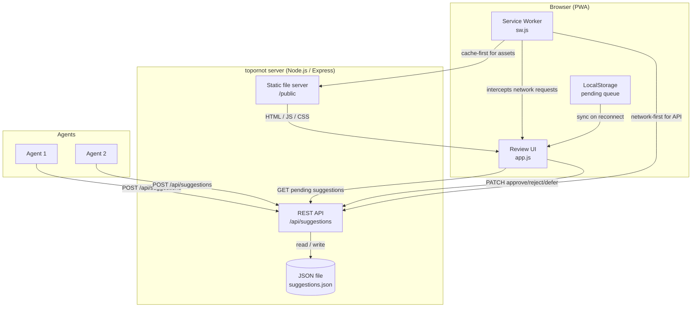

# topornot

Approval queue for agent-generated suggestions. Agents submit suggestions via a REST API; human reviewers approve, reject, or defer them through a card-based web UI (or directly through the API).

---

## Table of Contents

- [Features](#features)
- [Architecture](#architecture)
- [Prerequisites](#prerequisites)
- [Installation](#installation)
- [Running the application](#running-the-application)
- [Configuration](#configuration)
- [API reference](#api-reference)
- [Running tests](#running-tests)
- [Project structure](#project-structure)
- [Task management](#task-management)

---

## Features

- Simple card-based review UI – one suggestion at a time
- Keyboard shortcuts (`a` approve, `z` reject, `d` defer; arrow keys also work)
- Touch gestures – swipe right to approve, left to reject, up to defer
- Offline-first PWA – works without a network connection and syncs when reconnected
- Lightweight JSON file database – zero external dependencies to run locally
- REST API for programmatic integration with agents and CI pipelines

---

## Architecture



---

## Prerequisites

- [Node.js](https://nodejs.org/) v18 or later
- npm (bundled with Node.js)

---

## Installation

```bash
# 1. Clone the repository
git clone https://github.com/bmordue/topornot.git
cd topornot

# 2. Install dependencies
npm install
```

---

## Running the application

### Development (auto-restarts on file changes)

```bash
npm run dev
```

### Production

```bash
npm start
```

Open [http://localhost:3000](http://localhost:3000) in your browser.

---

## Configuration

Environment variables can be set before starting the server:

| Variable | Default | Description |
|----------|---------|-------------|
| `PORT` | `3000` | TCP port the HTTP server listens on |
| `DB_PATH` | `suggestions.json` (in the repository/server directory) | Path to the JSON file used as the database |

Example:

```bash
PORT=8080 DB_PATH=/data/suggestions.json npm start
```

---

## API reference

The full API is documented in [openapi.yaml](./openapi.yaml).

### Quick reference

| Method | Path | Description |
|--------|------|-------------|
| `GET` | `/api/suggestions` | List pending suggestions (add `?status=all` for all) |
| `POST` | `/api/suggestions` | Submit a new suggestion |
| `PATCH` | `/api/suggestions/:id/:action` | Act on a suggestion (`approve`, `reject`, `defer`) |

#### Create a suggestion

```bash
curl -X POST http://localhost:3000/api/suggestions \
  -H "Content-Type: application/json" \
  -d '{"title": "Add caching layer", "description": "Improve response times", "agent": "perf-agent"}'
```

#### Approve a suggestion

```bash
curl -X PATCH http://localhost:3000/api/suggestions/1/approve
```

---

## Running tests

```bash
npm test
```

Tests are written with [Jest](https://jestjs.io/) and [Supertest](https://github.com/ladjs/supertest) and cover all API endpoints.

---

## Project structure

```
topornot/
├── server.js          # Express app and API routes
├── db.js              # JSON file persistence layer
├── openapi.yaml       # OpenAPI 3.0 API specification
├── .tssk.json         # tssk task management config
├── .tsks/             # tssk task storage (JSONL + docs)
├── public/
│   ├── index.html     # Application shell
│   ├── app.js         # UI logic (card review, offline sync)
│   ├── style.css      # Styles
│   ├── sw.js          # Service Worker (PWA / offline support)
│   └── manifest.json  # PWA manifest
└── tests/
    └── api.test.js    # API integration tests
```

---

## Task management

This project uses [tssk](https://github.com/bmordue/tssk) for task tracking. Tasks are stored in `.tsks/` alongside the code.

### Prerequisites

Install tssk by building from source (requires Go 1.24+):

```bash
git clone https://github.com/bmordue/tssk.git
cd tssk
go build -o build/tssk .
mv build/tssk /usr/local/bin/
```

### Common commands

```bash
# List all tasks
tssk list

# List tasks by priority tag
tssk list --tag near-term
tssk list --tag medium-term
tssk list --tag longer-term

# Show task details
tssk show <id>

# Add a new task
tssk add --title "Task title" --detail "Detailed description"

# Update task status
tssk status <id> in-progress
tssk status <id> done

# List tasks ready to start (no blocking dependencies)
tssk ready

# Visualize tasks in the browser
tssk serve --open
```

### Task tags

Tasks are tagged by development timeline:

| Tag | Description |
|-----|-------------|
| `near-term` | High-priority items for the next development cycle |
| `medium-term` | Features planned for upcoming releases |
| `longer-term` | Future improvements and stretch goals |
